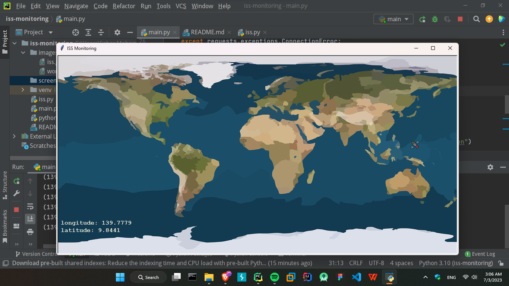

# ISS Monitoring
This is a Python project that monitors the International Space Station (ISS) using the turtle module. It displays the real-time longitude and latitude coordinates of the ISS on a world map and animates the movement of the ISS.

## Requirements
- Python 3.x
- `requests` library
- 
## Setup
1. Clone the repository or download the project files.
2. Install the required libraries by running the following command:
    ```commandline
    pip install requests
    ```
   
## Screenshots


## Usage
1. Open the `iss_monitoring.py` file in a Python IDE or text editor.
2. Run the script.
3. The ISS Monitoring application window will open, displaying a world map as the background.
4. The ISS location will be represented by <mark>an animated ISS icon moving on the map</mark>.
5. The longitude and latitude coordinates of the ISS will be displayed in the bottom-left corner of the window.
6. The program will continuously update the ISS location every 0.3 seconds.
7. To stop the program, close the application window or press Ctrl+C in the terminal.

## Project Structure
- `iss_monitoring.py`: The main Python script that monitors the ISS location and updates the display.
- `images/world_map.png`: Background image of the world map.
- `images/iss.gif`: Animated image of the ISS.

## Customization
- You can customize the background image of the world map by replacing the `images/world_map.png` file with your desired image.
- If you want to change the ISS icon, replace the `images/iss.gif` file with your preferred image. Make sure to update the corresponding image path in the code.

## Troubleshooting
- If you encounter a `requests.exceptions.ConnectionError` when fetching the ISS location, please ensure that you have a stable internet connection and try running the program again.
- If you face any other issues or errors, please check the Python error logs and make sure you have installed the required dependencies.

## Author
This project was developed by Saher Muhamed @ 2/7/2022.
